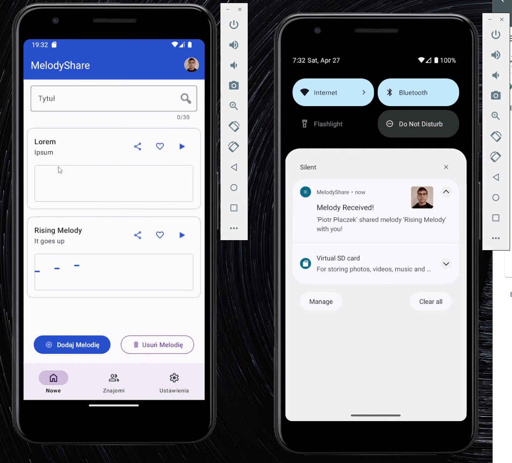

<!-- markdownlint-configure-file {
  "MD033": false,
  "MD041": false
} -->

# MelodyShare

An Android app for sharing melodies with friends!

CA submission for SETU's Mobile Application Development module.

## Features

- [x] Responsive Material Design 3 UI with dark mode support.
- [x] Create, search, edit, and remove playable melodies with validation and filtering.
- [x] Store melodies both locally and in the cloud with offline access thanks to Firebase.
- [x] Get notified when a user shares a melody with you thanks to Firebase Cloud Messaging.
- [x] English and Polish language support.

## Setup

### Firebase

> [!NOTE]
> Remember to generate and add the SHA to your Android app settings in Firebase,e.g.:
> `./gradlew signingReport`

This app uses [Firebase](https://firebase.google.com/) so you need to set-up a project and place the generated `google-services.json` into the `app/` directory.

### Google Cloud Functions

This project contains some Google Cloud Functions you need to setup in `google_cloud_functions/`:

- `addUserToDB`
    - Environment: 1st gen
    - Trigger: Firebase Authentication - create

- `sendFCM`
  - Environment: 1st gen
  - Trigger: Cloud Firestore - create - `shares/{shareId}`

## Contributing

- **Linting:** run the `ktlintFormat` Gradle task.
- **Documentation:** run the `dokkaHtml` Gradle task.
  - Dokka output will be generated to: `app/build/dokka/html/` 
- **Testing:** run the `test` Gradle task.
- **Test Coverage:** run the `connectedCheck` Gradle task.
  - Jacoco report will be generated to: `app/build/reports/androidTests/connected/debug/`

## Wireframes

Here are some of the original wireframes/sketches of the design for the app.

|                         App                         |                                Sequencer                                |
|:---------------------------------------------------:|:-----------------------------------------------------------------------:|
|  |  |

## License

The code in this repository is licensed under the [MIT License](https://opensource.org/license/mit), see [LICENSE.md](./LICENSE.md) for more details.
